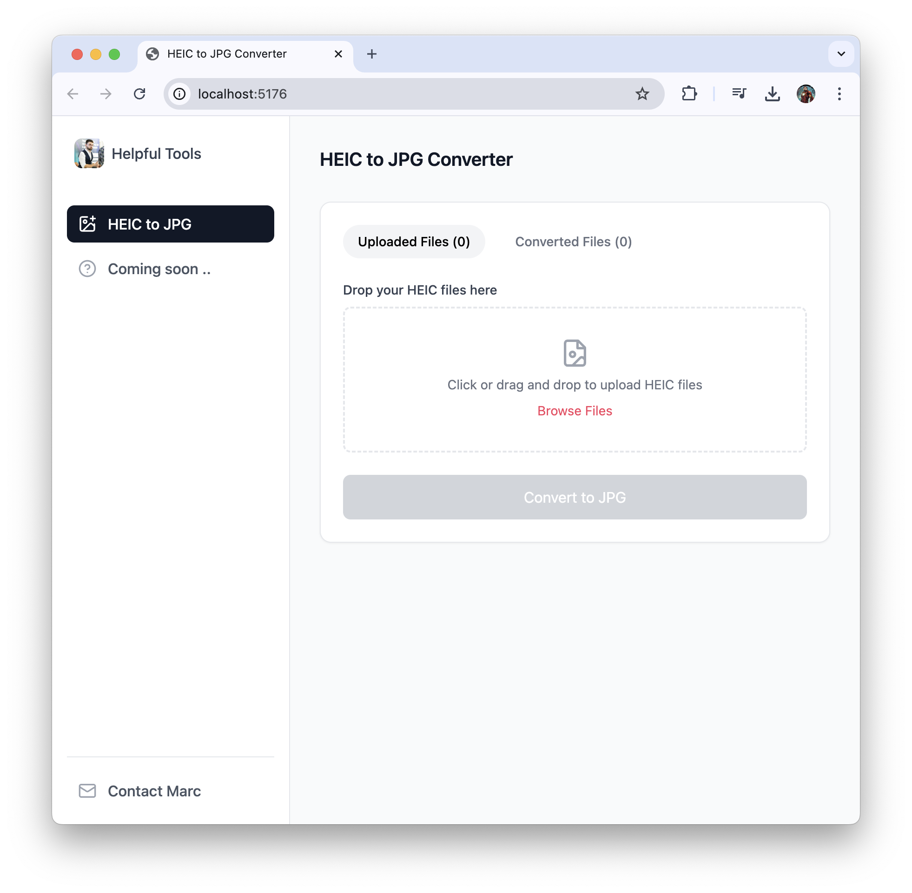

# HEIC to JPG Converter

A simple, browser-based tool to convert HEIC images to JPG format without uploading your files to any server. All conversion happens locally in your browser.


## Features

- 🖼️ Convert HEIC/HEIF images to JPG format
- 🔒 Privacy-focused: all processing happens in your browser
- 📱 Responsive design works on desktop and mobile
- 🚀 Fast conversion using modern web technologies
- 💾 Batch download all converted images

## How to Use

1. Drag and drop your HEIC files into the upload area or click to browse files
2. Click the "Convert to JPG" button
3. Once conversion is complete, download individual files or use "Download All"

## Technology Stack

- React.js for the UI
- Vite as the build tool
- TailwindCSS for styling
- heic2any for HEIC conversion
- react-dropzone for file uploads

## Development

### Prerequisites

- Node.js (v14 or newer)
- npm or yarn

### Setup

```bash
# Clone the repository
git clone https://github.com/doyouknowmarc/tools.git
cd helpfultools

# Install dependencies
npm install

# Start development server
npm run dev
```

### Build for Production

```bash
npm run build
```

### Preview Production Build

```bash
npm run preview
```

## Deployment to GitHub Pages

This project is configured for easy deployment to GitHub Pages. Follow these steps:

1. Create a GitHub repository for this project

2. Push your code to the GitHub repository:
   ```bash
   git remote add origin https://github.com/doyouknowmarc/helpfultools.git
   git branch -M main
   git push -u origin main
   ```

3. GitHub Actions will automatically build and deploy your site to GitHub Pages whenever you push to the main branch

4. Go to your repository settings > Pages to check the deployment status

5. Your site will be available at: `https://doyouknowmarc.github.io/helpfultools/`

## Contributing

Contributions are welcome! Feel free to open issues or submit pull requests.


## setup github pages
https://github.com/doyouknowmarc/tools

git init
git add -A
git commit -m "first commit" 
git branch -M main 
git remote add origin https://github.com/doyouknowmarc/tools.git # Replace with your username and repo URL
git push -u origin main